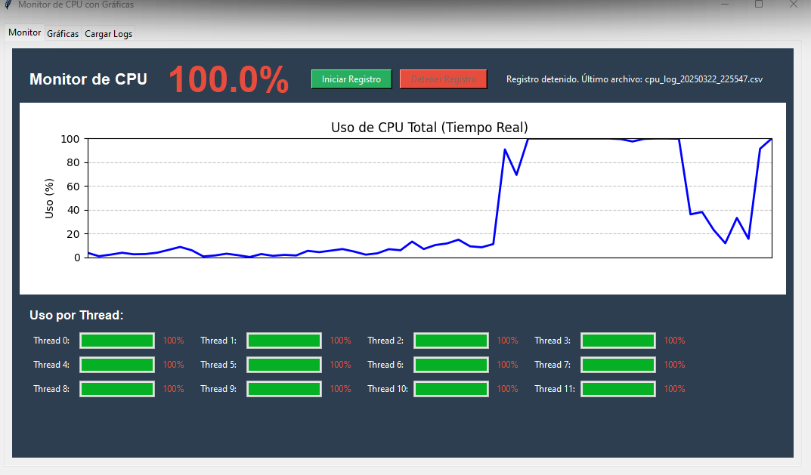
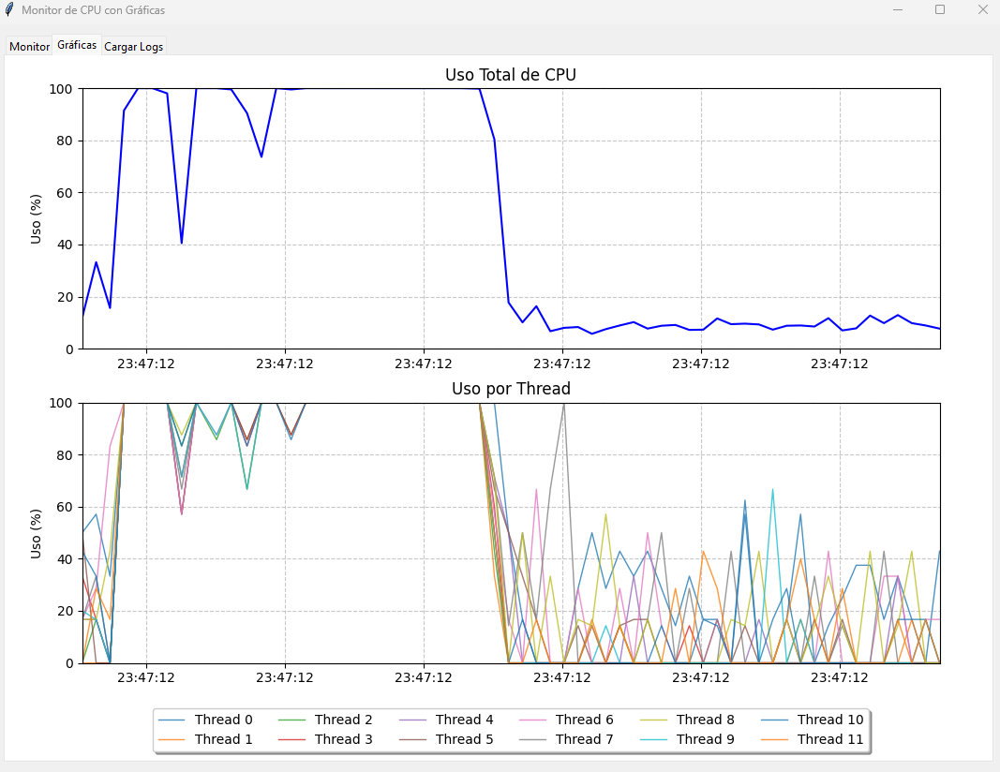
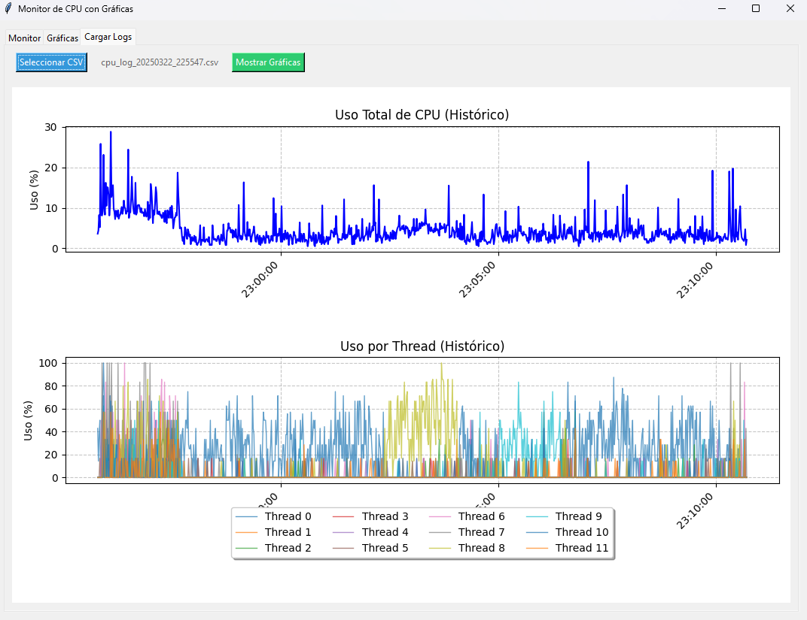
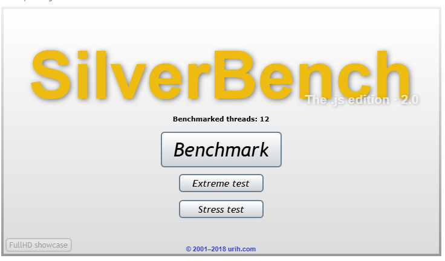

# CPU Usage Monitor with Graphs

 <!-- Add a general banner image -->

Graphical application to monitor CPU usage in real-time, log historical data, and visualize metrics. Ideal for performance analysis and stress testing.

---

## 📸 Screenshots

### 1. Main Panel (Real-Time Monitoring)
 <!-- Add real image -->
- **Visible Features**:
  - Total CPU usage percentage with color coding
  - Updatable line graph
  - Progress bars per thread
  - Log control buttons

### 2. Graphs Tab
 <!-- Add real image -->
- **Highlighted Content**:
  - Top graph: Evolution of total usage
  - Bottom graph: Breakdown by threads
  - Interactive time axes
  - Thread identification legend

### 3. Load Historical Logs

- **Key Elements**:
  - CSV file selector
  - File name preview
  - Rendered historical graphs
  - Time axes formatted as HH:MM:SS

---

## 🧪 Stress Testing with Chrome
To simulate CPU load and test the application, use the **web-based load generator**:

```markdown
https://silver.urih.com/
```

**How to Use**:
1. Open the link in Chrome
2. Select the load intensity (e.g., 80%)
3. Run the test while monitoring in the application
4. Compare real-time vs historical results

 <!-- Optional image of the testing website -->

---

## 🔄 Recommended Workflow
1. **Live Monitoring**: Observe your CPU's baseline usage
2. **Stress Test**: Generate load using the suggested website
3. **Data Logging**: Save results to CSV
4. **Historical Analysis**: Load and compare previous logs

---

> **Note**: The screenshots shown are illustrative. To see the actual functionality, run the application and test with different workloads.

[⬆️ Back to Top](#cpu-usage-monitor-with-graphs)